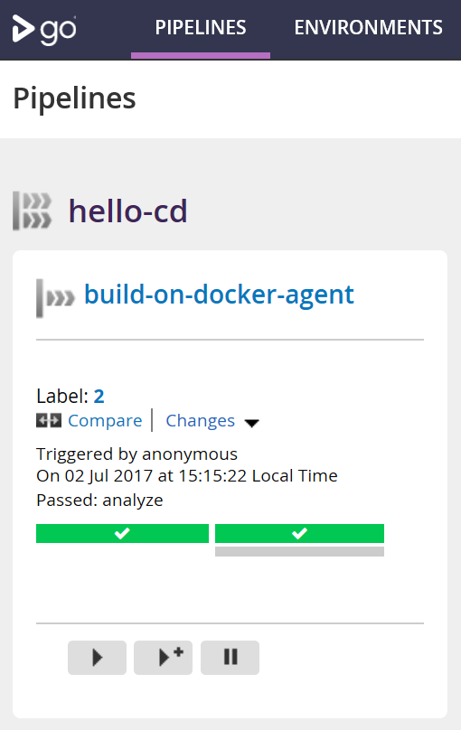

## **Try it out:**
### **Set up a local _Continuous Integration_ pipeline, running in docker**

This will:
 * Start a registry, where artifacts are stored as docker images.
 * Start a GoCD server, which polls the local repo for changes (commits) which kicks off the [pipeline](./gocd/config.gocd.yaml#5).
 * Start a GoCD agent with [socket binded "docker-in-docker"](https://medium.com/lucjuggery/about-var-run-docker-sock-3bfd276e12fd). It connects to the server and gets delegated the individual tasks defined by the [pipeline](./gocd/config.gocd.yaml#21).

Run the following commands in order (on windows, let each script finish before running the next):
```
git clone https://github.com/helmesjo/hello-cd.git
cd hello-cd
./docker/start-registry.sh
./gocd/start-server.sh
./gocd/start-agent.sh
```
_Note: It might take a while the first time, since no image-layers are present locally and must be downloaded._

When all is done, you can run _``docker ps``_ to verify that three containers are up and running (gocd server+agent & docker registry):

![][containers]

Within a minute when the server has spun up, go to [localhost](http://localhost:8153/go) and you should see the pipeline:



Each run can be inspected, and stuff like [code coverage](http://localhost:8153/go/tab/build/detail/build-on-docker-agent/1/analyze/1/code-analysis#) can be viewed in ([custom](./gocd/config.gocd.yaml#L32)) tabs:

![][code-coverage]

[containers]: ./examples/docker-ps.png "Containers"
[code-coverage]: ./examples/code-coverage.png "Code Coverage"


## **Current status**, what works so far:

### **Building & Testing**
- Trivial one-step scripts, scripts/build.sh & scripts/analyze-coverage.sh (minimal, using CMake).
- Requires only a C++ compiler to be present (cross-platform with docker = easy). Coverage-steps ignored if not GCC & Lcov installed.
- _No dependancies on anything else_ = Docker, GoCD or whatever is optional/easily replaceable.
- All output/artifacts is relative to the install path, which can be passed from the command line (artifacts include libs, docs, code-coverage, test results etc, all in one place.).


### **Docker**
- Two, again trivial, scripts (docker/build.sh & docker/analyze-coverage.sh) doing nothing more than starting a container, passing the above build/analyze-coverage scripts as argument.
- Dependencies like CMake & C++ compiler is managed in the docker image = very flexible.
- The containers pass artifacts using private registry (docker commit/pull), currently pointing to "localhost:5000" (which is easily configurable if hosting registry remotely). Alternatively gocd publish/fetch artifact tasks can be used, but they are less storage efficient (docker reuses layers).
- "Artifacts" are the whole build for that commit (source + compiled +docs etc.).
        
### **GoCD**
- Server & agents running in docker containers.
- Agents using "docker in docker" (through socket-binding, not pure "dind").
- All logic for the building & testing is in the repo, so starting new server instances is trivial. 
- Basic, ready to go scripts to fire up server & registry, automatically connecting agents to the server. (this should be replaced by docker-compose, but currently there is some host-setup needed which isn't trivial with docker-compose).      
- Pipeline configuration is kept in repository (server is thus minimal, basically contains nothing more than a "load remote config"-config).
- Jobs are minimal, not caring about artifacts etc. (this is managed by the docker build-scripts). Jobs just run "build.sh" & "runtests.sh", keeping the "heavy" logic out of the server.
        
        
## **TODO**
- Fix docker-compose for GoCD setup, including registry.
- ~~Add test-result output (tests passed/failed, details of failes etc), perferably in HTML-friendly format.~~
- ~~Add support for test coverage, result perferably in HTML-friendly format.~~
- Add support for static analysis, result perferably in HTML-friendly format.
- Host local gitrepo on docker http server (nginx) and reference this from server & agents using the overlay network driver.
- Do above as separate "pipeline steps", so that they can be easily moved around in the pipeline config depending on their importance/time consumption etc.
